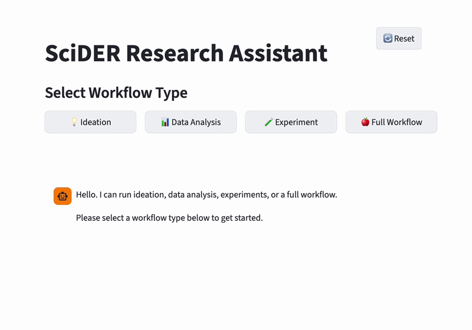
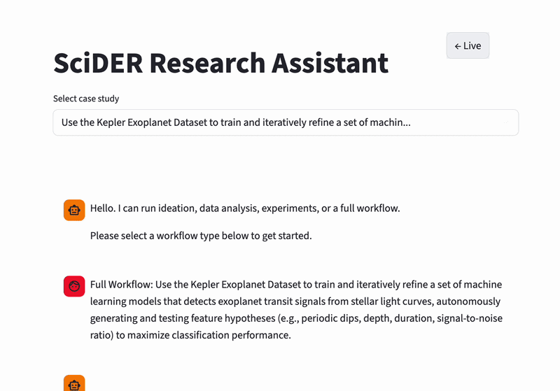

# SciEvo

```shell
# for cpu
uv sync --extra cpu

# for mac
uv sync --extra mac

# for gpu
uv sync --extra cu128
```

Optional: install Claude Code (for `claude_code` toolset):

- Ensure the `claude` CLI is installed and authenticated on your machine.
- If your `claude` command needs extra flags, set `CLAUDE_CODE_CMD`, e.g.:

```shell
export CLAUDE_CODE_CMD="claude"
```

Optional: install Claude Agent SDK (for `claude_agent_sdk` toolset):

- Docs: `https://platform.claude.com/docs/en/agent-sdk/overview`
- Install:

```shell
pip install claude-agent-sdk
export ANTHROPIC_API_KEY="..."
```

## Web UI

The web UI is a Streamlit application. Deploy it using the Dockerfile at the project root, or run locally from the `streamlit-client` directory.

**Select workflow type and get started:**



Web interface of the SciDER Research Assistant showing the workflow selection panel. Users can initiate different research workflows—Ideation, Data Analysis, Experiment, or a Full Workflow—through a set of interactive buttons, enabling the system to support various stages of the scientific research process from idea generation to experimental execution.

**Case study selection and full workflow example:**



Web interface of the SciDER Research Assistant demonstrating the selection of a case study for a full research workflow. In this example, the system loads a Kepler Exoplanet dataset task, where the agent autonomously conducts ideation, feature hypothesis generation, model training, and experimental evaluation to detect exoplanet transit signals from stellar light curves.

## Development Guide

First, install `pre-commit`:
```shell
pip install pre-commit
```

Install `pre-commit` to format code:
```shell
pre-commit install
```

Then, copy `.env.template` to `.env` and fill in the necessary values.
```
OPENAI_API_KEY=<your_openai_api_key>
GEMINI_API_KEY=<your_gemini_api_key>
```
