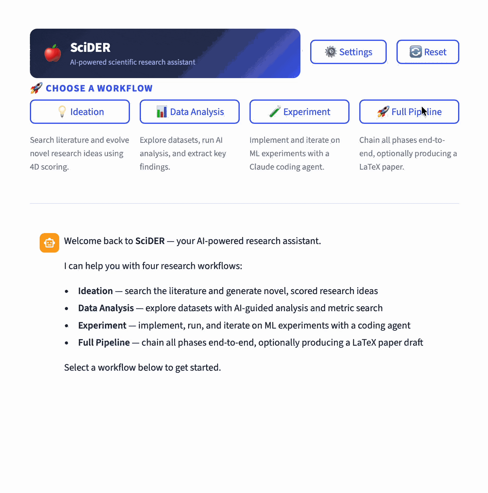
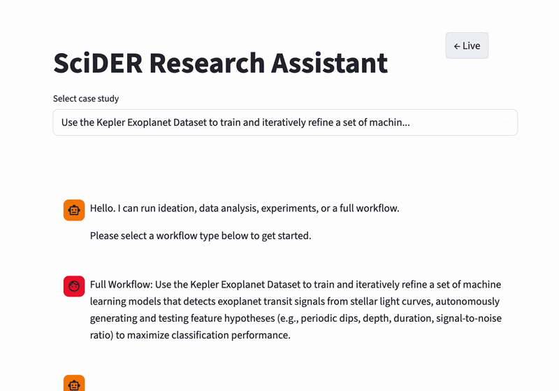

<!-- ---
title: SciDER
emoji: 🍎
colorFrom: indigo
colorTo: purple
sdk: docker
pinned: false
--- -->

<div align="center">
  
  <h1 align="center">SciDER: Scientific Data-centric End-to-end Researcher
 </h1>
</div>

<div align="center">
    <a href="https://harryluumn.github.io/scider-proj-page/"></a>
    <a href="https://huggingface.co/collections/leonardklin/scider"></a>
    <a href="https://huggingface.co/spaces/leonardklin/SciDER"></a>
    <br/>
    <a href="https://arxiv.org/abs/2603.01421"></a>
    <br/>
    <a href="https://www.python.org/downloads/">
    </a>
    <a href="https://pre-commit.com/">
    </a>
</div>

## Table of Contents

- [Installation](#installation)
- [Workflows](#workflows)
- [Paper Writing & Templates](#paper-writing--templates)
- [Configuration](#configuration)
- [Web UI](#web-ui)
- [Coding Backend](#coding-backend)
- [Skills](#skills)
- [Development Guide](#development-guide)
- [Benchmarks](#benchmarks)
- [Feedback and Contributions](#feedback-and-contributions)
- [Reference](#reference)

## Installation

You can install the project using `pip`:

```shell
# from git
pip install git+https://github.com/leonardodalinky/SciDER
# locally
pip install -e .
```

Example Usage:

```python
from scider.default.models import register_gemini_medium_high_models
from scider.workflows import run_full_workflow

# 1. Register the models you want to use
register_gemini_medium_high_models()
# 2. Run the full workflow
wf = run_full_workflow(
    data_path="/path/to/data/",
    workspace_path="/path/to/workspace/",
    user_query="Discover insights about RAG",
)
# 3. The final state after the workflow
print(wf.final_summary)
```

## Workflows

SciDER provides seven workflows in `scider.workflows`:

| Workflow | Description |
|---|---|
| `IdeationWorkflow` | Generate research ideas from literature search. |
| `DataWorkflow` | Analyze a dataset and produce a structured summary. |
| `HypoDataWorkflow` | Generate synthetic data from a feature description, then analyze it. |
| `ExperimentWorkflow` | Implement and run an experiment given a data summary. |
| `WritingWorkflow` | Turn SciDER outputs (data summary, experiment log, ideas) into a venue-formatted LaTeX/PDF paper. |
| `FullWorkflow` | Data analysis -> experiment execution -> (optional) paper writing. |
| `FullWorkflowWithIdeation` | Ideation -> (optional) data analysis -> (optional) experiment -> (optional) paper writing. Each phase can be skipped via flags. |

Each workflow has a class form (`FooWorkflow`) and a convenience function (`run_foo_workflow`).

## Paper Writing & Templates

The `WritingWorkflow` (and the optional paper-writing phase of the full workflows) generates a publication-ready LaTeX paper. SciDER ships **7 venue templates** — NeurIPS, ACL, ICML, ICLR, AAAI, IEEE, and ACM. The official style files (`.sty`/`.bst`/`.cls`) are auto-downloaded and cached on first use, and matching `\usepackage` lines are activated automatically. Select a template in the Web UI or pass `paper_template_dir_path` to the workflow.

## Configuration

The project is configured using environment variables. You can set these variables in a `.env` file at the root of the project. A template `.env.template` is provided for reference. You can also set them directly in your shell or terminal session.

### Model catalog

SciDER uses a **unified model catalog** so you can mix providers per agent role. `model_settings/catalog.yaml` is the single source of truth for every model SciDER knows about (provider, LiteLLM id, capabilities, required env vars). `model_settings/role_defaults.yaml` then assigns a model to each role — e.g. Claude for `experiment`, Gemini for `data` — with inline param overrides:

```yaml
defaults:
  experiment: claude-opus-4-6[reasoning_effort=medium]
  data: gemini-2.5-pro[reasoning_effort=medium]
```

Provide any combination of provider keys (`ANTHROPIC_API_KEY`, `GEMINI_API_KEY`, `OPENAI_API_KEY`, ...) in `.env`. Frontend selections on the Settings page override these defaults.

## Web UI

The web UI is a Streamlit application. It supports:

- Live token/cost usage tracking (updated during runs and pauses)
- Cancel and pause controls for in-progress workflows
- Test-API-connection buttons on the Settings page
- Evolutionary idea search toggle
- Venue paper-template picker for the full workflow

### Run locally

From the project root:

```shell
bash streamlit-client/run.sh
```

Or manually:

```shell
uv sync --extra streamlit
uv run python -m streamlit run streamlit-client/app.py --server.port 7860
```

Then open `http://localhost:7860`. On first launch a Settings page appears for configuring providers, API keys, and per-role model assignments.

### Run with Docker

Deploy it using the `Dockerfile` at the project root.

1. Create a `.env` file at the project root (copy from `.env.template`) and fill in your API keys.

2. Build the image:

```shell
docker build -t scider:latest .
```

3. Run the container:

```shell
docker run -d \
  --name scider \
  -p 7860:7860 \
  --env-file .env \
  scider:latest
```

4. Access the UI at `http://localhost:7860`.

**UI Example**:

<table>
  <tr>
    <td></td>
    <td></td>
  </tr>
  <tr>
    <td align="center"><b>Select workflow type and Get started</b></td>
    <td align="center"><b>Case study selection and Full workflow</b></td>
  </tr>
</table>

## Coding Backend

The experiment agent delegates code implementation to a coding subagent. Two backends are available, selectable via the `CODING_AGENT_VERSION` environment variable:

| Backend | Value | Description |
|---|---|---|
| Claude Agent SDK (default) | `claude_sdk` | Delegates to Claude Agent SDK. Requires `pip install claude-agent-sdk` and `ANTHROPIC_API_KEY`. |
| Native | `native` | SciDER's built-in coding agent. Uses the `experiment_coding` model role with any LiteLLM-supported provider. No external dependencies. Pick this if you want a non-Claude provider (Gemini, GPT, etc.). |

Set `CODING_AGENT_VERSION` in `.env` to switch backends.

## Skills

Skills are markdown files with YAML frontmatter that inject domain-specific guidance into an agent's system prompt. Modeled after Claude Code, they can be either **preloaded** (full content injected) or **on-demand** (listed by name, loaded via the `Skill` tool when needed).

### Discovery

On startup, SciDER walks up from the workspace directory to the filesystem root (plus `~`), scanning `.scider/skills/` at each level. Closer directories override identically-named skills from parents. Supported layouts:

```
.scider/skills/
├── my-skill/
│   ├── SKILL.md              # directory format — can bundle reference files
│   └── references/
│       └── usage.md
└── another.md                # single-file format
```

Frontmatter fields:

```yaml
---
name: my-skill
description: One-line summary shown in the on-demand listing.
allowed_agents: [data, experiment]   # omit → available to all agents
preload_for: [data]                  # omit → on-demand only (must be called via Skill tool)
---
```

For directory-format skills, SciDER automatically injects `Base directory for this skill: <absolute path>` at the top of the content so the model can resolve relative file references (e.g. `references/usage.md`) via the `Read` tool.

### Dynamic Registration

You can also register skills programmatically, overriding frontmatter fields:

```python
from scider.core.skills import SkillRegistry

# Single directory
SkillRegistry.instance().register_skill_dirs(
    "path/to/my-skill",
    allow=["experiment", "native_coding"],
    preload_for=["experiment"],
)

# Multiple directories at once
SkillRegistry.instance().register_skill_dirs(
    ["path/to/skill-a", "path/to/skill-b"],
    allow=["data"],
)
```

`allow` restricts which agents see the skill; `preload_for` controls which agents get the full content in their system prompt. Both accept a `Literal` of the valid agent names (`ideation`, `data`, `experiment`, `experiment_coding`, `native_coding`, `critic`, `paper_search`, `writing`, `approval`) for static type checking. Passing `None` for either keeps the value from the SKILL.md frontmatter.

## Development Guide

First, install `pre-commit`:
```shell
pip install pre-commit
```

Install `pre-commit` to format code:
```shell
pre-commit install
```

Then, copy `.env.template` to `.env` and fill in the necessary values.

Finally, run the following command to sync dependencies:
```shell
# for cpu
uv sync --extra cpu

# for mac
uv sync --extra mac

# for gpu
uv sync --extra cu128

# streamlit client
uv sync --extra streamlit
```

Run tests with:
```shell
uv run pytest tests/
```

## Benchmarks

See [BENCHMARKS](./benchmarks) for details on the benchmarks we have conducted to evaluate SciDER's performance.

## Feedback and Contributions

We welcome contributions to improve SciDER. Please open an issue or submit a pull request on our GitHub repository.

Also, any feedback on the project is greatly appreciated. You can fill the [feedback form](https://forms.gle/Vz4K55J8ePTEs6TU8) to rate this app and help to improve the project.

## Reference

If you find SciDER useful in your research, please consider citing our paper:

```bibtex
@article{lin2026scider,
  title={SciDER: Scientific Data-centric End-to-end Researcher},
  author={Lin, Ke and Aijaz, Owais and Lu, Yilin and Bhat, Shreyas and Guo, Xuehang and Oliva, Junier},
  journal={arXiv preprint arXiv:2603.01421},
  year={2026},
  doi={10.48550/arXiv.2603.01421}
}
```

Paper: [arXiv:2603.01421](https://arxiv.org/abs/2603.01421) · DOI: [10.48550/arXiv.2603.01421](https://doi.org/10.48550/arXiv.2603.01421)
